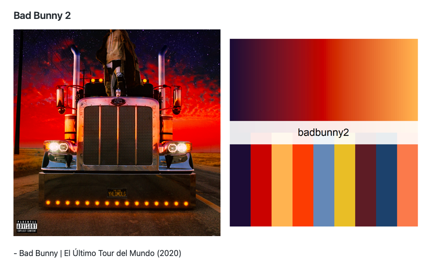

```{r,echo=FALSE, out.width="40%",fig.align="center"}
knitr::include_graphics("logoPUCP.png") 
```

Hasta este punto en el curso, nos hemos enfocado en las diferentes etapas del trabajo con bases de datos para obtener un insumo limpio, ordenado, estructurado y listo para ser analizado. Este proceso incluye la apertura, limpieza, formateo, agregación y unificación de los datos. Una vez logrado esto, estamos preparados para presentar nuestros resultados a un público no necesariamente familiarizado con el análisis cuantitativo. Por ello, debemos procurar presentar nuestra información y *contar la historia* de la manera más clara y efectiva posible.

A esto se le conoce como visualización de datos o *storytelling* con datos. Existe una gran variedad de gráficos que se pueden utilizar, dependiendo del interés y los objetivos del investigador. Aquí algunos ejemplos útiles: <https://www.data-to-viz.com/>

La visualización de datos es importante, ya que ayuda a contar historias y a *dar sentido* a los datos con los que trabajamos, facilitando la comprensión de la información.

Sin embargo, es crucial tener en cuenta que la finalidad de la visualización es facilitar la comprensión, por lo que hay que ser cuidadosos con la elección de ciertos tipos de gráficos. Por ejemplo, el gráfico de sectores o *pie chart* puede no ser siempre la mejor opción, a pesar de que la variable analizada lo permita. Para profundizar en este tema: <https://www.data-to-viz.com/caveat/pie.html>

Veamos algunos ejemplos:


### 1. Gráficos de barras

Vamos a traer de un repo de Github la última ola del Barómetro de las Américas para medir el nivel de confianza en los medios de comunicación (b37) en la región:
```{r}
library(rio)
lapop = import("LAPOP_reduced_merge.dta")
```

Para graficar los resultados de esta variable, hay que tomar en cuenta que tiene 7 categorías. Presentar tantas opciones en un gráfico, para varios países a la vez, podría confundir al espectador/a. Tenemos que manipular un poco la información.

```{r}
# Explorar la variable de confianza en los medios (b37)
table(lapop$b37)
```

Donde 1 es "nada de confianza" y 7 es "mucha confianza", vamos a volver esta variable dicotómica para facilitar la visualización:

```{r}
# Recodificar la variable b37 de 7 categorías a dicotómica
library(car)
lapop$b37r <- car::recode(lapop$b37, "1:4=0 ; 5:7=100")
table(lapop$b37r)
```

Al momento de leer la base de datos en R, el software importa las variables como numéricas. La variable "pais" se tiene que convertir en una variable de tipo "factor" y se tiene que etiquetar.

```{r}
# Convertir la variable "pais" a factor y etiquetar los niveles
lapop$pais <- as.factor(lapop$pais)
levels(lapop$pais) <- c("México", "Guatemala", "El Salvador", "Honduras",
"Nicaragua","Costa Rica", "Panamá", "Colombia",
"Ecuador", "Bolivia", "Perú", "Paraguay",
"Chile", "Uruguay", "Brasil", "Venezuela",
"Argentina", "Rep. Dom.", "Haití", "Jamaica",
"Estados Unidos", "Canada")

table(lapop$pais)
table(lapop$pais, lapop$year)
```

Queremos hacer un gráfico de barras con intervalos de confianza para evaluar el nivel de confianza en los medios en perspectiva comparada. Para eso, necesitamos hacer una tabla que le saque el promedio a la variable (que es la proporción de personas que dicen confiar en los medios). La función *summarySE* es útil para eso:

```{r}
# Calcular el promedio de confianza por país usando summarySE()
library(Rmisc)
df <- summarySE(data = lapop, measurevar = "b37r", groupvar = "pais", na.rm = TRUE)
df
```

Con esta estructura de datos, ya podemos graficar. El nivel más sencillo de visualización sería con lenguaje base de R o códigos simples de la librería *ggplot*. Todo empezaría así:

```{r}
library(ggplot2)
library(farver)
ggplot(df, aes(x=pais, y=b37r)) + 
  geom_bar(stat = "identity") 
```

Eso no dice básicamente nada. Mejoremos el gráfico un poco. Podríamos voltearlo para que tenga más sentido.

```{r}
ggplot(df, aes(x=pais, y=b37r)) + 
  geom_bar(stat = "identity") + coord_flip()
```

Sigue sin ayudarnos a entender a qué país le va mejor y a cuál le va peor en términos de confianza en los medios. Cambiemos algunas cosas adicionales: reordenemos la columnas y pongamos títulos a los ejes:

```{r}
# Mejorar el gráfico: voltear ejes, reordenar barras y agregar títulos
ggplot(df, aes(x = reorder(pais, b37r), y = b37r)) +
geom_bar(stat = "identity") +
coord_flip() +
labs(title = "Confianza en los medios en las Américas",
subtitle = "Barómetro de las Américas",
x = " ",
y = "Escala 0 - 100")
```

Eso está bastante mejor, pero sería bueno que pongamos el valor que obtiene cada país para ese año:

```{r}
# Mejorar el gráfico: voltear ejes, reordenar barras, agregar títulos y porcentajes
ggplot(df, aes(x = reorder(pais, b37r), y = b37r)) +
geom_bar(stat = "identity") +
coord_flip() +
labs(title = "Confianza en los medios en las Américas",
subtitle = "Barómetro de las Américas",
x = " ",
y = "Escala 0 - 100") +
geom_text(aes(label = paste0(round(b37r, 0), "%")), vjust = 0.5, hjust = 1.2, color = "white", size = 3)
```

Se ve un poco feo. Cambiemos el tamaño, ubicación y color. También podemos ponerle el símbolo de % y una línea con el promedio para saber quiénes pasan y quiénes no:

```{r}
ggplot(df, aes(x=reorder(pais,b37r), y=b37r), fill = select) + 
  geom_bar(stat = "identity") +
  coord_flip()+
  
  labs(title = "Confianza en los medios en las Américas",
       subtitle = "Barómetro de las Américas",
       x = " ",
       y = "Escala 0 - 100") +

    geom_hline(yintercept = mean(df$b37r) ,linetype="dashed", color="blue",size=1)+
  
    ylim(0, 80) +

    geom_text(aes(label=paste0(round(b37r,0),"%")), vjust=0.5, hjust = 1.2,color="white", size=3)
```

Faltan los intervalos de confianza:

```{r}
# Agregar línea de promedio e intervalos de confianza
g1 <- ggplot(df, aes(x = reorder(pais, b37r), y = b37r)) +
geom_bar(stat = "identity") +
geom_errorbar(aes(ymin = b37r - ci, ymax = b37r + ci), width = 0.2) +
coord_flip() +
labs(title = "Confianza en los medios en las Américas",
subtitle = "Barómetro de las Américas",
x = " ",
y = "Escala 0 - 100") +
geom_hline(yintercept = mean(df$b37r), linetype = "dashed", color = "blue", size = 1) +
ylim(0, 80) +
geom_text(aes(label = paste0(round(b37r, 0), "%")), vjust = 0.5, hjust = -1, color = "black", size = 3)

g1
```

El gráfico ya estaría prácticamente listo. Sin embargo, hay algunas librerías que aplican automaticamente "temas" al gráfico para mejorarlo. Una es *ggthemes*. Pueden jugar con sus funciones aquí: <https://statisticsglobe.com/ggthemes-package-r>. Veamos lo que puede hacer. También podemos ajustar los tamaños del gráfico en su conjunto:

```{r}
# Aplicar temas predefinidos de ggplot2
library(ggthemes)
g1 + theme_fivethirtyeight()
```

Otro tema:

```{r}
g1 + theme_economist()
```

¿Presentar más información? Qué pasa si queremos trabajar con barras agrupadas. Por ejemplo, si queremos mostrar no solo la confianza en los medios, sino también la atención que la ciudadanía le da a los medios. Hagamos el ejercicio.

La variable:

```{r}
# Explorar la variable de atención a los medios (gi0)
str(lapop$gi0)
table(lapop$gi0)
```

Los valores están invertidos. Hacemos una recodificación simple.

```{r}
# Recodificar la variable gi0
lapop$gi0r <- car::recode(lapop$gi0, "3:5=0 ; 1:2=100")
table(lapop$gi0r)
```

Construimos la tabla con todos los detalles. 

```{r}
# Calcular el promedio de atención por país usando summarySE()
df1 <- summarySE(data = lapop, measurevar = "gi0r", groupvar = "pais", na.rm = TRUE)
df1
```

Juntamos la información, pero antes necesitamos diferenciar una cosa de la otra:

```{r}
# Crear una columna para diferenciar confianza y atención
df$type <- "Trust in media"
df1$type <- "Attention to news"
```

Los nombres de las columnas deben ser los mismos. Solo hay uno que se diferencia:

```{r}
colnames(df)[3] = "value"
colnames(df1)[3] = "value"
```

Ahora sí. ¿Alguien sabe por qué no hice merge?

```{r}
# Combinar los dataframes de confianza y atención
dff <- rbind(df, df1)
```

Graficamos. El principal detalle aquí está en position, donde ponemos *dodge*. Ver: <https://r-graph-gallery.com/48-grouped-barplot-with-ggplot2>

```{r}
# Crear un gráfico de barras agrupadas para confianza y atención
g2 <- ggplot(dff, aes(x = reorder(pais, value), y = value, fill = type)) +
geom_bar(position = "dodge", stat = "identity") +
coord_flip() +
geom_errorbar(aes(ymin = value - ci, ymax = value + ci), position = position_dodge(0.95), width = 0.2) +
labs(title = "Confianza y atención a los medios en las Américas",
subtitle = "Barómetro de las Américas",
x = " ",
y = "Escala 0 - 100") +
geom_text(aes(label = paste0(round(value, 0), "%")), vjust = 0.5, hjust = -0.8, color = "black", size = 3,
position = position_dodge(width = 1)) +
theme(legend.position = "bottom") + labs(fill = ' ')

g2
```

Le damos un tema y cambiamos las dimensiones para que se vea mejor:

```{r echo=FALSE,message=FALSE,warning=FALSE,eval=TRUE,fig.show='hold',fig.width=9,fig.height=6.5, fig.align="center"}
g2 + theme_economist()
```

También podemos escoger paletas de colores interesantes que podemos agregar a nuestros gráficos en ggplot. Por ejemplo, la librería *peRReo* toma las paletas de colores de varios artistas: <https://github.com/jbgb13/peRReo#building-palettes>

```{r,echo=FALSE, out.width="60%",fig.align="center"}
 
```

```{r}
#install.packages("devtools")
library(callr)
devtools::install_github("jbgb13/peRReo") 
library(peRReo)
pal=latin_palette("badbunny2",2,type="continuous")
```

```{r echo=FALSE,message=FALSE,warning=FALSE,eval=TRUE,fig.show='hold',fig.width=9,fig.height=6.5, fig.align="center"}
g2 + scale_fill_manual(values=pal) +
  theme_minimal()
```

También tenemos de Taylor Swift:

Instalamos esto en R y llamamos a la librería "taylor"
```{r}
#remotes::install_github("wjakethompson/taylor")
```

Más información sobre esta librería por aquí: <https://taylor.wjakethompson.com/index.html>

```{r,echo=FALSE, out.width="60%",fig.align="center"}
knitr::include_graphics("ts.png") 
```

```{r echo=FALSE,message=FALSE,warning=FALSE,eval=TRUE,fig.show='hold',fig.width=9,fig.height=6.5, fig.align="center"}
library(taylor)
g3 = g2 + scale_fill_taylor_d(album="Fearless (Taylor's Version)") +
  theme_minimal()
```

Pueden encontrar más alternativas en: taylor_album_songs

```{r}
# Hacer el gráfico interactivo con plotly
library(plotly)
gg <- ggplotly(g3)
gg
```

### 2. Gráficos de líneas

¿Cómo ha evolucionado el país en términos de democratización? Al hablar de "evolución", nos referimos inevitablemente a un componente temporal. Un gráfico de líneas puede ser útil. Traigamos una base para ejemplificarlo:

```{r}
# Cargar la base de datos de V-Dem
vdem <- import("vdemdata.csv")
# Filtrar los datos para Perú
per <- vdem[vdem$country_name == "Peru",]
```

Podemos ver la evolución de la democracia en el Perú:

```{r}
# Crear un gráfico de líneas básico para la evolución de la democracia en Perú
g1 <- ggplot(per, aes(x = year, y = v2x_polyarchy)) +
geom_line()
```

Podemos mejorarlo bastante. Lo bueno de *ggplot* es que sigue la misma lógica para casi todos los gráficos:

```{r}
# Mejorar el gráfico con títulos, etiquetas y tema
g2 <- ggplot(per, aes(x = year, y = v2x_polyarchy)) +
geom_line() +
labs(title = "Índice de democracia electoral - Perú",
subtitle = "V-Dem",
x = "Año",
y = "Escala 0 - 1") +
guides(col = guide_legend("Grupo:")) +
theme_fivethirtyeight()

g2
```

```{r}
# Hacer el gráfico interactivo con plotly
gg1 <- ggplotly(g2)
gg1
```

¿Lo vemos en perspectiva comparada? Para eso necesitaríamos el promedio regional. Apliquemos funciones de *dplyr* que vimos en la clase de agregación de datos:

```{r}
# Calcular el promedio regional de democracia por año usando dplyr
library(dplyr)
reg <- vdem %>%
group_by(year) %>%
summarise(democracy = mean(v2x_polyarchy, na.rm = TRUE))
```

Agregamos la identificación:

```{r}
# Agregar una columna para identificar los datos regionales
reg$group <- "AL"
```

Necesitamos modificar la estructura de la base de Perú para juntar la información:

```{r}
# Modificar la estructura de los datos de Perú para unirlos con los datos regionales
per <- per[, c(3, 4)]
per$group <- "PER"
colnames(per)[2] <- "democracy"
```

Juntamos todo. De nuevo, no hago merge, ¿se va entendiendo el tipo de estructura que necesitamos?

```{r}
# Combinar los datos de Perú y los datos regionales
democ <- rbind(reg, per)
table(democ$group) # Verificar que todo esté bien
```

```{r message=FALSE,eval=TRUE,fig.show='hold',fig.width=8.5,fig.height=6}
# Crear un gráfico de líneas para comparar la evolución de la democracia en Perú y América Latina
g3 <- ggplot(democ, aes(x = year, y = democracy, colour = group, group = group)) +
geom_line() +
labs(title = "Índice de democracia electoral - Perú y América Latina",
subtitle = "V-Dem",
x = "Año",
y = "Escala 0 - 1") +
guides(col = guide_legend("Grupo:")) +
theme_fivethirtyeight()

g3
```

```{r}
# Hacer el gráfico interactivo con plotly
gg2 <- ggplotly(g3)
gg2
```

### 3. Gráfico de dispersión de puntos

¿Tendrá una relación el apoyo a la democracia con el nivel de democratización de un país? Podríamos explorar una correlación entre ambas cosas. Traigamos la base:

```{r}
# Cargar la base de datos
points <- import("scatter_data.csv")
```

```{r}
# Crear un gráfico de dispersión básico
g1 <- ggplot(points, aes(x = v2x_polyarchy, y = democracy)) +
geom_point()

g1
```

Parece que hay una relación, pero no sabemos qué país representa cada punto. No son muchos, por lo que podríamos visualizar esto sin problema. Juguemos un poco con las funciones que estamos viendo en los ejemplos previos:

```{r message=FALSE,eval=TRUE,fig.show='hold',fig.width=9,fig.height=6}
# Mejorar el gráfico de dispersión
g2 <- ggplot(points, aes(x = v2x_polyarchy, y = democracy)) +
geom_point(size = 1.5, shape = 23) +
geom_text(label = points$pais, vjust = -0.5, hjust = 1, color = "black", size = 3) +
labs(title = "Apoyo a la democracia e índice de democracia electoral \nen América Latina y El Caribe",
subtitle = "Barómetro de las Américas y V-Dem",
x = "Índice de democracia electoral",
y = "Apoyo a la democracia") +
theme_fivethirtyeight()

g2
```

```{r}
# Hacer el gráfico interactivo con plotly
gg1 <- ggplotly(g2)
gg1
```


Eso está bastante mejor. Se podría decir que a mayor avance de democratización, mayor apoyo a la democracia. Pero vemos que Perú es un caso atípico. Podríamos resaltar esa diferencia con respecto al patrón observado:

Primero señalamos Perú en la base con un condicional simple:

```{r}
# Resaltar Perú como un caso atípico
points$atipico <- factor(ifelse(points$pais == "Peru", 1, 0))
```

```{r message=FALSE,eval=TRUE,fig.show='hold',fig.width=9,fig.height=6, warning=F}
# Crear un gráfico de dispersión resaltando Perú
g3 <- ggplot(points, aes(x = v2x_polyarchy, y = democracy, color = atipico)) +
geom_point(size = 3, shape = 20) +
geom_text(label = points$pais, vjust = -0.5, hjust = 1, color = "black", size = 3) +
labs(title = "Apoyo a la democracia e índice de democracia electoral \nen América Latina y El Caribe",
subtitle = "Barómetro de las Américas y V-Dem",
x = "Índice de democracia electoral",
y = "Apoyo a la democracia") +
scale_color_manual(values = c('Blue', 'Red')) +
theme_fivethirtyeight()

g3
```

```{r}
# Ocultar la leyenda
g4 <- g3 + theme(legend.position = "none")
```

```{r}
# Hacer el gráfico interactivo con plotly
gg2 <- ggplotly(g4)
gg2
```


### 4. Barras de error

Cuando trabajamos con encuestas, hay que recordar que lo que obtenemos de la muestra son estimadores que, dentro de un intervalo de confianza, nos permiten hablar de la población en su conjunto a un % de confianza. ¿Cómo graficamos todo eso? Veamos:

Traigamos una base de datos que contiene información sobre un índice que muestra la disposición de la ciudadanía en el Perú a movilizarse políticamente para empujar ciertas demandas. Los datos provienen del Latinobarómetro para el año 2020:


```{r}
# Cargar la base de datos
errorbars <- import("parpol_age.csv")
```

Arrancamos con lo más básico. Queremos ver si esta disposición varía entre grupos etarios:

```{r}
# Crear un gráfico básico de líneas con barras de error
g1 <- ggplot(errorbars, aes(x = age, y = media, group = 1, label = media)) +
geom_line() +
geom_errorbar(width = .1, aes(ymin = media - ci, ymax = media + ci))

g1
```

No está tan mal, pero podríamos mejorarlo bastante. Lo primero sería ordenar el eje de las edades y asignarles nombres a cada categoría:

```{r}
# Ordenar el eje de las edades y asignar nombres a cada categoría
errorbars$age <- factor(errorbars$age, levels = c(1:6), labels = c("25 o menos", "Entre 26 y 35",
"Entre 36 y 45", "Entre 46 y 55",
"Entre 56 y 65", "De 66 a más"))
```

```{r}
 ggplot(errorbars, aes(x=age, y=media, group=1, label = media)) +
    geom_line() +
      geom_errorbar(width=.1, aes(ymin=media-ci, ymax=media+ci)) 
```

Ahora apliquemos las funciones de *ggplot* y *ggthemes*:

```{r message=FALSE,eval=TRUE,fig.show='hold',fig.width=9.5,fig.height=6}
# Crear un gráfico mejorado con las funciones de ggplot y ggthemes
g2 <- ggplot(errorbars, aes(x = age, y = media, group = 1, label = media)) +
geom_line() +
geom_errorbar(width = .1, aes(ymin = media - ci, ymax = media + ci)) +
geom_point(shape = 21, size = 3, fill = "white") +
ylim(45, 80) +
labs(x = "Grupo etario",
y = "Índice de participación") +
geom_text(aes(label = round(media, 2)), vjust = -2, hjust = 1.3, color = "black", size = 4) +
scale_color_fivethirtyeight() +
theme_fivethirtyeight()

g2
```

```{r}
# Hacer el gráfico interactivo con plotly
gg1 <- ggplotly(g2)
gg1
```


¿Podemos darle a esto una mirada comparada y diferenciar la participación según temáticas de interés? Claro! Traigamos la base de datos:

```{r}
# Cargar la base de datos para la comparación
errorbars2 <- import("parpol_wvs.csv")
```

```{r message=FALSE,eval=TRUE,fig.show='hold',fig.width=10,fig.height=6}
# Crear un gráfico comparativo con facetas
g3 <- ggplot(errorbars2, aes(x = year, y = media, group = Group, color = Group, label = media)) +
geom_line() +
geom_errorbar(width = .1, aes(ymin = media - ci, ymax = media + ci)) +
geom_point(shape = 21, size = 3, fill = "white") +
ylim(45, 75) +
labs(x = "Año",
y = "Porcentaje") +
geom_text(aes(label = paste0(round(media, 0), "%")), vjust = 0, hjust = 1.3, color = "black", size = 3) +
facet_wrap(~type, ncol = 3, dir = "v") +
scale_color_fivethirtyeight() +
theme_fivethirtyeight()

g3
```

```{r}
# Hacer el gráfico interactivo con plotly
gg2 <- ggplotly(g3)
gg2 <- gg2 %>% layout(title = list(text = paste0("Porcentaje de participación por tipo<br>",
"<sup>", "World Values Survey", "</sup>"),
y = 0.97, # Ajustar la posición vertical del título
yanchor = "top", # Anclar el título a la parte superior
yref = "container", # Referencia para la posición vertical
pad = list(b = 80))) # Espacio entre el título y el gráfico

gg2
```

### 5. Gráficos de densidad

Ahora, qué pasa cuando queremos evaluar la distribución o el comportamiento de una variable continua. Para ello, los gráficos de densidad son bastante útiles. Traigamos una base de datos sobre las últimas EG para ver el comportamiento del voto en segunda vuelta a nivel distrital.

```{r}
# Cargar la base de datos
dens <- import("EG_2021.csv")
```

Podemos ver la distribuciones del voto por cada candidato por separado:

```{r}
# Separar los datos por candidato
pl <- dens[dens$ganador == "PL", ]
fp <- dens[dens$ganador == "FP", ]
```

Comportamiento del voto en distritos en los cuales ganó Perú Libre. El gráfico más básico:

```{r}
# Crear un gráfico básico de densidad para los distritos ganados por Perú Libre
g1 <- ggplot(pl, aes(x = VALIDOS_PL, fill = VALIDOS_PL)) +
theme(legend.position = "bottom") +
geom_density(alpha = 0.4, color = "red", fill = "red", linetype = "dashed")

g1
```

```{r}
# Hacer el gráfico interactivo con plotly
gg1 <- ggplotly(g1)
gg1
```

Agregamos algunas cosas:

```{r}
# Mejorar el gráfico de densidad para los distritos ganados por Perú Libre
g2 <- ggplot(pl, aes(x = VALIDOS_PL, fill = VALIDOS_PL)) +
theme(legend.position = "bottom") +
geom_density(alpha = 0.4, color = "red", fill = "red", linetype = "dashed") +
ggtitle("Distritos ganados por Perú Libre") +
xlab("Votos válidos") +
ylab("Densidad") +
geom_vline(aes(xintercept = mean(VALIDOS_PL)), color = "black", linetype = "dashed", size = 0.5) +
theme_fivethirtyeight()

g2
```

```{r}
# Hacer el gráfico interactivo con plotly
gg2 <- ggplotly(g2)
gg2
```

Hacemos lo mismo para los distritos en los que gana Fuerza Popular:

```{r}
# Crear un gráfico de densidad para los distritos ganados por Fuerza Popular
g3 <- ggplot(fp, aes(x = VALIDOS_FP, fill = VALIDOS_FP)) +
theme(legend.position = "bottom") +
geom_density(alpha = 0.4, color = "orange", fill = "orange", linetype = "dashed") +
ggtitle("Distritos ganados por Fuerza Popular") +
xlab("Votos válidos") +
ylab("Densidad") +
geom_vline(aes(xintercept = mean(VALIDOS_FP)), color = "black", linetype = "dashed", size = 0.5) +
theme_fivethirtyeight()

g3
```

```{r}
# Hacer el gráfico interactivo con plotly
gg3 <- ggplotly(g3)
gg3
```

```{r}
# Crear un dataframe con los datos de ambos candidatos
dens_combined <- rbind(
data.frame(candidato = "Perú Libre", votos = pl$VALIDOS_PL),
data.frame(candidato = "Fuerza Popular", votos = fp$VALIDOS_FP)
)

# Crear el gráfico de densidad superpuesto
g4 <- ggplot(dens_combined, aes(x = votos, fill = candidato)) +
geom_density(alpha = 0.4) +
scale_fill_manual(values = c("Perú Libre" = "red", "Fuerza Popular" = "orange")) +
ggtitle("Distribución de votos válidos por candidato") +
xlab("Votos válidos") +
ylab("Densidad") +
theme_fivethirtyeight() +
theme(legend.position = "bottom")

# Hacer el gráfico interactivo con plotly
gg4 <- ggplotly(g4)
gg4
```

### 6. Mapas

Valdría la pena mirar esto a nivel georreferenciado:

```{r}
#Solucionando el problema de los ubigeos:
dens$CCODI_UBIGEO=stringr::str_pad(dens$CCODI_UBIGEO, 6, side = "left", pad = 0)
dens$UBIGEO = substr(dens$CCODI_UBIGEO,1,2)
dens$UBIGEO = paste0(dens$UBIGEO, "0000")
```

Agrupamos los datos por departamento:

```{r}
map = dens %>%
  group_by(DEPA,UBIGEO) %>%
  summarise(PL_DEPA = sum(VOTOS_PL, na.rm = T),
            FP_DEPA = sum(VOTOS_FP, na.rm = T))
```

Sacamos el porcentaje del voto por cada partido:

```{r}
map$total = map$PL_DEPA+map$FP_DEPA
map$FP_FREQ = map$FP_DEPA/map$total
map$PL_FREQ = map$PL_DEPA/map$total
map$VIC = factor(ifelse(map$PL_DEPA>map$FP_DEPA,1,0))
map$VIC = factor(map$VIC, levels = c(0:1), labels = c("FP","PL"))
```

Abrimos los shapes. Recordamos la primera sesión!

```{r include=FALSE}
library(sf) 
mapDEP=sf::read_sf("DEPARTAMENTO.shp")
head(mapDEP) #Veamos la geometría:
```

Juntamos la información con la data geolocalizada:

```{r include=FALSE}
mapDEP2=merge(mapDEP,map,by.x='DEPARTAMEN',by.y='DEPA', all.x = T)
head(mapDEP2)
```

```{r echo=FALSE,message=FALSE,warning=FALSE,eval=TRUE,fig.show='hold',fig.width=8,fig.height=7}
###Mapa votos válidos por Fuerza Popular:

mapaleyendaL= ggplot(mapDEP2)+ geom_sf() + theme_light()

mapaleyL= mapaleyendaL + geom_sf(data=mapDEP2,
              aes(fill=VIC),color = "gray")
      
mapa4= mapaleyL +
coord_sf() + 
scale_fill_manual(values=c("darkorange","firebrick1")) + theme_void() +
  
  
theme(axis.title = element_blank(), axis.text = element_blank(), legend.position = c(1.1,0.55)) + labs(fill=" ") + theme(legend.text = element_text(size = 13)) +
  
labs(title = "Departamentos ganados por cada partido",caption = "Fuente: ONPE 2021\nElaborado por: Alexander Benites (@asbenitesa)") +
  
theme(
plot.title = element_text(color="black", size=15, face="bold"),
plot.caption = element_text(color = "black", size=10))

mapa4
```

También podemos hacer mapas de calor, tomando como variable continua el porcentaje del total de votos que obtuvo cada partido:

```{r echo=FALSE,message=FALSE,warning=FALSE,eval=TRUE,fig.show='hold',fig.width=8,fig.height=7}

mapaleyendaL= ggplot(mapDEP2)+ geom_sf() + theme_light()

mapaleyL= mapaleyendaL + geom_sf(data=mapDEP2,
              aes(fill=PL_FREQ),color = NA)
      
mapa3= mapaleyL +
coord_sf() + 
scale_fill_gradient(low = "seashell",  high = "firebrick", breaks=seq(from=0, to=1, by=.2)) + theme_void() + 
  
theme(axis.title = element_blank(), axis.text = element_blank(), legend.position = c(1.1,0.55)) + labs(fill=" ") + theme(legend.text = element_text(size = 13)) +
  
labs(title = "% de votos válidos por Perú Libre", subtitle = "Escala del 0 al 1",caption = "Fuente: ONPE 2021\nElaborado por: Alexander Benites (@asbenitesa)") +
  
theme(
plot.title = element_text(color="black", size=15, face="bold"),
plot.caption = element_text(color = "black", size=10))

mapa3
```

```{r}
# Hacer el gráfico interactivo con plotly
ggmapa3 <- ggplotly(mapa3)
ggmapa3
```

