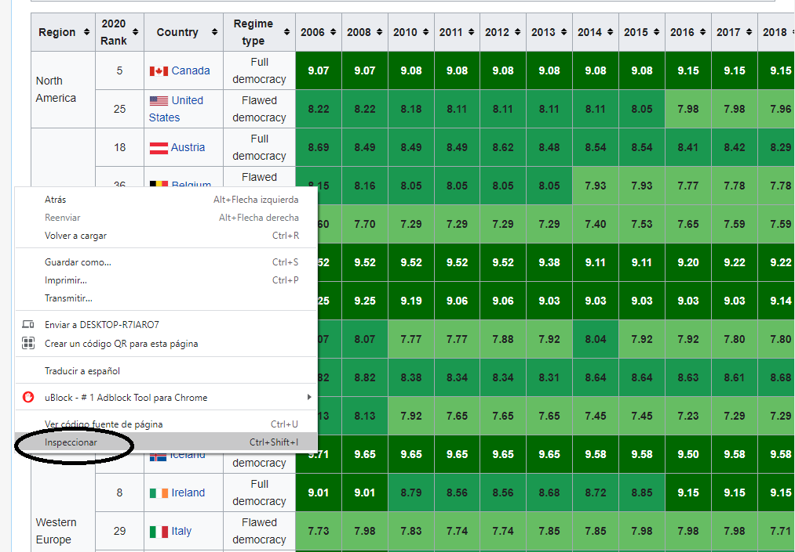
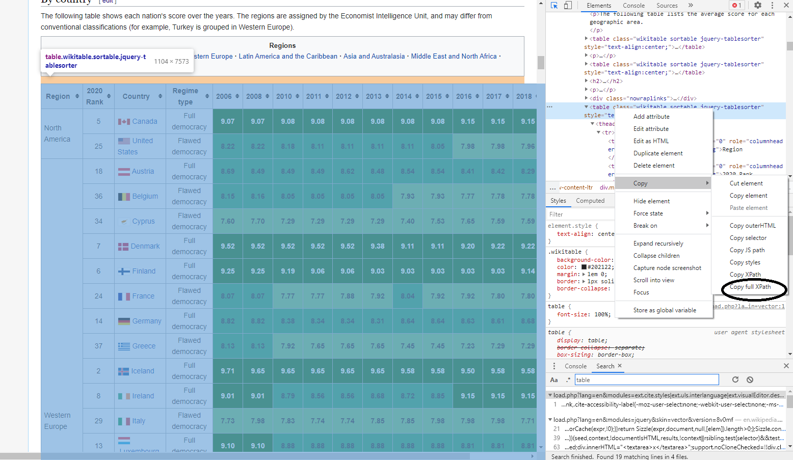
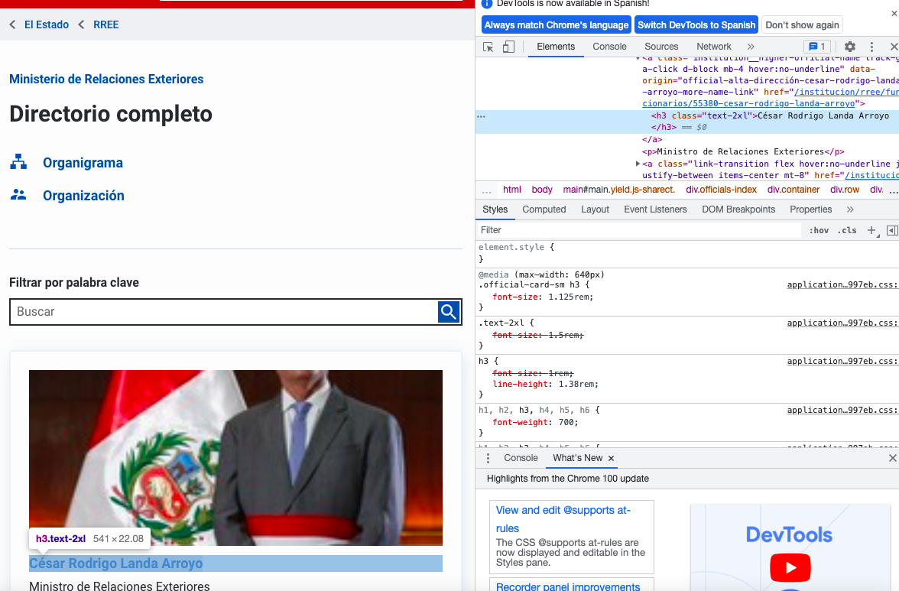

```{r,echo=FALSE, out.width="40%",fig.align="center"}
knitr::include_graphics("logoPUCP.png") 
```

Existe una web para máquinas y otra para humanos (el mundo del HTML, lo que todos usamos a diario al acceder a páginas web en nuestro ordenador). Hoy vamos a aprender a bajar información de ambas fuentes de datos.

Hoy aprenderemos a descargar datos desde servicios web que proporcionan información a través de "APIs" que son consultadas directamente por ordenadores. Asimismo, aprenderemos a bajar información programáticamente de las páginas web usando las técnicas de "scraping".


# **1. 'Scraping' tablas de datos**

*Video sobre qué es el scrapping*: "What is Web Scraping and What is it Used For?" <https://www.youtube.com/watch?v=Ct8Gxo8StBU>


Ahora aprendamos a bajar información programáticamente de las páginas web usando las técnicas de "scraping".

En la vida real, no siempre nos darán las bases de datos listas para trabajar con ella,en muchos casos debemos descargarlas de páginas web y debemos limpiar y ordenar nuestra bbdd.


## Opción 1

Vamos a ver como extraer tablas que están en una web, es decir no son archivos cargados o "colgados", sino tablas que han sido dibujadas por el programador.

Las tablas de datos en la web pueden ser descargadas con facilidad, si se consigue identificar la ruta hacia ella. Cuando identifiques una tabla que te interesa, usa el botón derecho de tu mouse para inspeccionar el código de la página web. Usa la opción inspección hasta que resalte toda la tabla.

Vamos a extraer la tabla de los resultados del "Democracy Index" por país, de la siguiente dirección: <https://en.wikipedia.org/wiki/Democracy_Index>

Estando en esa página usando **GoogleChrome** ubícate en la tabla e inspecciona usando el botón derecho:

```{r,echo=FALSE, out.width="40%",fig.align="center"}
 
```

Debes inspeccionar hasta que se resalte tu tabla:

Nota que en este caso tienes varias tablas, debes ser muy preciso en tu selección. Una vez haya identificado bien tu tabla, usa nuevamente el botón derecho sobre el código en html y copia el XPATH. 

En **firefox** el procedimiento es el mismo.

```{r,echo=FALSE, out.width="40%",fig.align="center"}
 
```

Para extraer nuestra base de datos, utilizamos la función "read_html" del paquete "rvest" (instalenlo antes):

```{r echo=TRUE, message=FALSE, warning=FALSE}
library(rvest)

link = "https://en.wikipedia.org/wiki/Democracy_Index"
path = '//*[@id="mw-content-text"]/div[1]/table[4]'
dataWS <- read_html(link)%>%html_nodes(xpath = path)%>%html_table()%>% .[[1]]
head(dataWS)
```

Otro ejemplo:

De la página web de la CIA, vamos a extraer una tabla sobre el PBI percápita: https://www.cia.gov/the-world-factbook/field/real-gdp-per-capita/country-comparison

Procedemos: 

```{r}
linkCIA_pbi = "https://www.cia.gov/the-world-factbook/field/real-gdp-per-capita/country-comparison"
linkPath_pbi ='//*[@id="index-content-section"]/div/div[2]/div/div/div/div/table'
dataWS2 = read_html(linkCIA_pbi)%>%html_nodes(xpath = linkPath_pbi)%>%html_table()%>% .[[1]]
head(dataWS2)
```

## Opción 2

Vamos a ver otra forma de "scrapear": ¿qué pasa si los datos que quiero obtener no están en un formato de tabla? Es decir no han sido programados en la página web de esa forma.

Más aún, qué pasaría si quisiéramos extraer datos de una página web como esta: <https://www.gob.pe/institucion/presidencia/funcionarios>

Para estas ocasiones, **rvest** también nos sirve.

+ Primero, abrimos la libreria y creamos un objeto con el link de la página web. Asimismo, obtenemos el código html de la web, con la función "read_html". Esto lo ponemos dentro de un objeto.


```{r}
library(rvest)
url="https://www.gob.pe/institucion/rree/funcionarios"
pagina_web=read_html(url)
```


+ Para scrapear vamos a requerir obtener la clase CSS de los campos que necesitamos. En términos sencillos, la clase CSS es un código que identifica a uno o varios elementos HTML. En esta página web, "Nombre" y "Cargo" han sido programados con una clase CSS para cada una.

Esta clase CSS la podemos obtener de la siguiente manera. Comencemos por Nombre

+ Hacemos click derecho sobre el renglón de un país y seleccionamos inspeccionar:

+ Luego, automaticamente en la parte derecha se nos abrirán los códigos resaltando el que pertenece a ese espacio, colocamos nuestro mouse por encima de esa linea resaltada del código y se nos aparecerá la clase CSS. Ese código lo escribimos copiamos.

```{r,echo=FALSE, out.width="40%",fig.align="center"}
 
```

Con ese código, continuamos de la siguiente manera:

```{r}
css_nombre="h3.text-2xl" # contenemos la clase CSS en un objeto
nombre_html <- html_nodes(pagina_web,css_nombre) # con html_nodes (selecciona los nodos) y html_text (extrae el texto de los nodos seleccionados), obtenemos el código html que contiene los nombres
nombre_texto <- html_text(nombre_html) 
head(nombre_texto) #vemos los datos
```

Hacemos lo mismo para la otra columna "cargo"

```{r}
css_cargo="p"
cargo_html <- html_nodes(pagina_web,css_cargo)
cargo_texto <- html_text(cargo_html)
head(cargo_texto)
```

Finalmente, armamos la base de datos

```{r}
dataWS3 <- data.frame(NOMBRE = nombre_texto, CARGO = cargo_texto)
head(dataWS3)
```

Hay casos en los que podemos observar una tabla, pero Htmltab no funciona. Por ejemplo: <https://www.congreso.gob.pe/pleno/congresistas/>

Utilicemos rvest:

```{r}
url="https://www.congreso.gob.pe/pleno/congresistas/"
pagina_web=read_html(url)
```

```{r}
css_nombre="a.conginfo" # contenemos la clase CSS en un objeto
nombre_html <- html_nodes(pagina_web,css_nombre) # con html_nodes y html_text, obtenemos el código html que contiene los países
nombre_texto <- html_text(nombre_html) 
head(nombre_texto) #vemos los datos
```

```{r}
css_grupo="span.partidolist"
grupo_html <- html_nodes(pagina_web,css_grupo)
grupo_texto <- html_text(grupo_html)
head(grupo_texto)
```

```{r}
dataWS4 <- data.frame(NOMBRE = nombre_texto, GRUPO = grupo_texto)
head(dataWS4)
```

Uno más complejo: la página de funcionarios/as del MEF

<https://www.gob.pe/institucion/mef/funcionarios>

```{r}
url="https://www.gob.pe/institucion/mef/funcionarios"
pagina_web=read_html(url)


css_nombre="h3.text-2xl" 
nombre_html <- html_nodes(pagina_web,css_nombre)
nombre_texto <- html_text(nombre_html) 

css_cargo="p"
cargo_html <- html_nodes(pagina_web,css_cargo)
cargo_texto <- html_text(cargo_html)

dataWS5 <- data.frame(NOMBRE = nombre_texto, CARGO = cargo_texto)
head(dataWS5)
```

Pero nos faltan funcionarios/as. Solo estamos jalando la primera página de tres. ¿Qué hacemos aquí?

Para esto vamos a aprender a utilizar funciones e iteraciones, que nos permita descargar las páginas de manera sistemática. 

Una función es un conjunto de instrucciones que convierten las entradas (inputs) en resultados (outputs) deseados. Las iteraciones (loops) son de gran utilidad cuando necesitamos hacer la misma tarea con multiples entradas; repetir la misma operación en diferentes columnas o en diferentes conjuntos de datos.

Creamos los objetos necesarios:

```{r}
url="https://www.gob.pe/institucion/mef/funcionarios?sheet="
css_cargo="p"
css_name="h3.text-2xl"
final_table = list() # list es una función para crear listas
```

Construimos la función e iteración

```{r}
library(dplyr)
for(i in 1:7) { # INPUT
  webpage <- read_html(paste0(url, i)) #obtenemos el código html de las 3 páginas
  cargo_texto <- webpage %>%
    html_nodes(css_cargo) %>% # obtener el código html del css del cargo
    html_text() # lo convertimos en un vector de texto
  name_texto <- webpage %>%
    html_nodes(css_name) %>% # obtener el código html del css del name
    html_text() # lo convertimos en un vector de texto

final_table[[i]] <- data.frame(NOMBRE=name_texto, CARGO=cargo_texto) # OUTPUT: Con esto estamos creando una lista con 3 data frames que contenga las 7 páginas scrapeadas
}
```

Ahora convertimos todo en una base de datos

```{r}
dataWS6 = bind_rows(final_table)
head(dataWS6)
```

Podríamos hacer lo mismo para el grupo parlamentario?

<https://www.congreso.gob.pe/pleno/congresistas/>

```{r}
url="https://www.congreso.gob.pe/pleno/congresistas/?=undefined&m1_idP="
css_nombre="a.conginfo"
css_grupo="span.partidolist"
final_table = list() # list es una función para crear listas
```

```{r}
library(dplyr)
for(i in 1:13) { # INPUT
  webpage <- read_html(paste0(url, i)) #obtenemos el código html de las 3 páginas
  grupo_texto <- webpage %>%
    html_nodes(css_grupo) %>% # obtener el código html del css del cargo
    html_text() # lo convertimos en un vector de texto
  name_texto <- webpage %>%
    html_nodes(css_nombre) %>% # obtener el código html del css del name
    html_text() # lo convertimos en un vector de texto

final_table[[i]] <- data.frame(NOMBRE=name_texto, GRUPO=grupo_texto) # OUTPUT: Con esto estamos creando una lista con 3 data frames que contenga las 13 páginas scrapeadas
}
```

```{r}
dataWS7 = bind_rows(final_table)
head(dataWS7)
```


# **3. Exportar la base de datos**

Finalmente ¿Cómo exportamos las bases de datos que hemos obtenido? 
En muchos casos nos va ser útil exportar a CSV,lo podemos hacer con la función export del paquete rio:

```{r}
#library(rio)
#export(dataWS, "midata.csv") 
```

Si hay problemas con el encoding:


```{r}
#export(dataWS1, "dataWS1.csv")
#dataWS1 = import("dataWS1.csv", encoding = "UTF-8")
#head(dataWS1)
```


Practiquemos:

<https://www.bcrp.gob.pe/transparencia/datos-generales/directorio/funcionarios.html>

<https://www.gob.pe/institucion/reniec/funcionarios>

<https://www.filmaffinity.com/es/ranking.php?rn=ranking_fa_movies>


